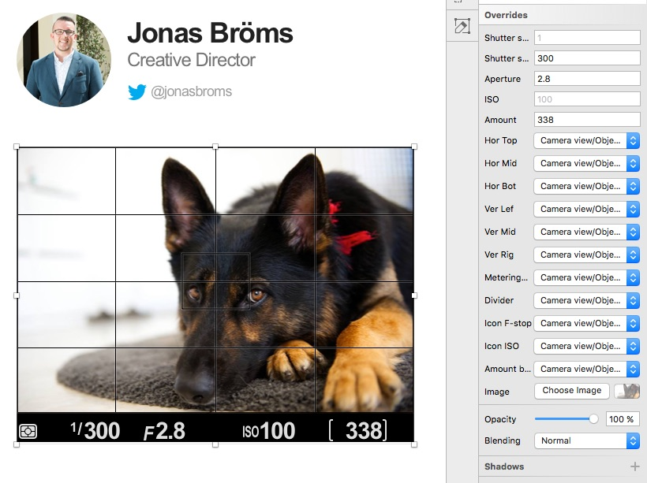

# Camera view
If you work as a Art/Creative Director and need to give direction to a photographer without having the opportunity of being on location, this document aims to improve that communication.
And yeah, thats my dog.



## Requirements
* [Sketchapp](https://www.sketchapp.com/)


## Architecture
```
Styled Text /
│
└── (-) Camera view /
     │
     ├── (-) Component
     │    │
     │    ├── (+) Author
     │    └── (+) Camera view
     │
     └── (-) Object
          │
          ├── (-) Icons
          │    │
          │    ├── (+) Amount brackets
          │    ├── (+) F-stop
          │    ├── (+) Shutter speed
          │    ├── (+) ISO
          │    └── (+) Metering mode
          │
          └── (-) Grid
              │
              └── (-) Lines
                   ├── (-) Vertical
                   └── (-) Horizontal
```


## Disclaimer
While I have redrawn and shared these assets for the benefit of the design community, I does not own any of the underlying product or user interface designs. By accessing these assets, you agree to obtain all necessary permissions from the underlying rights holders and/or adhere to any applicable brand use guidelines before using them. I disclaims all express or implied warranties with respect to these assets, including non-infringement of intellectual property rights.
